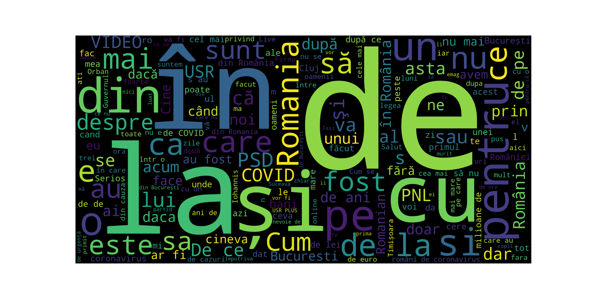

### What is it?

I wanted to do a wordcloud on one of the local subreddits to see what the most common words are.
The subreddit targeted is [/r/Romania](https://www.reddit.com/r/Romania/).

[pushshift.io](https://pushshift.io/) provides an API you can query to get data from Reddit in the form of a JSON.
We get all the titles in a specified timeframe (1 year), save them to disk, then run all these titles through wordcloud.
The result? You can see the wordcloud for all (~7000) submissions in 2021 below.

### Requirements
- Python3
- python3 -m install wordcloud

### How to run
- make sure to edit the output folders in analyzr.py
- run with: python3 analyzr.py
